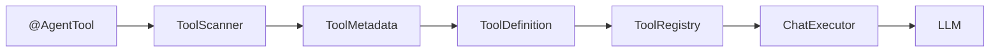

# Sprint3 - Tool Framework

## Overview

Sprint3 introduces the first framework capability of AgentFlow.

The framework evolves from manual tool registration to annotation-driven tool discovery.

## Architecture

## Core Flow

## Design Principles

- Annotation-driven programming
- Separation of metadata and execution
- Single Responsibility Principle
- Registry pattern
- Framework over business logic

## Core Components

| Component | Responsibility |
|-----------|----------------|
| AgentTool | Tool metadata declaration |
| ToolScanner | Discover tool beans |
| ToolMetadata | Tool metadata model |
| ToolDefinition | Runtime tool definition |
| ToolRegistry | Tool registration center |
| ChatExecutor | Execute AI requests |