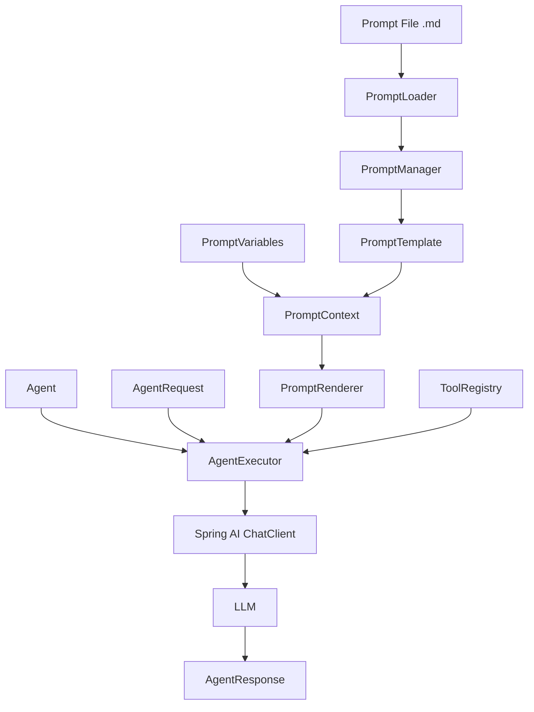

# Sprint4 - Prompt & Execution Framework

## Overview

Sprint4 introduces the Prompt Framework and the first version of the Agent Execution Framework.

## Architecture

## Core Components

| Component | Responsibility |
|---|---|
| PromptTemplate | Describes a prompt template |
| PromptLoader | Loads prompt files from resources |
| PromptManager | Registers and manages prompt templates |
| PromptVariables | Holds prompt variables |
| PromptContext | Represents prompt rendering context |
| PromptRenderer | Renders prompt content |
| Agent | Defines agent runtime configuration |
| AgentRequest | Represents an agent execution request |
| AgentResponse | Represents an agent execution result |
| AgentExecutor | Executes an agent request |

## Design Decisions

- Prompt is managed as a framework resource instead of hard-coded strings.
- Agent execution uses `Agent`, `AgentRequest`, and `AgentResponse`.
- Tool Framework and Prompt Framework are connected through `AgentExecutor`.