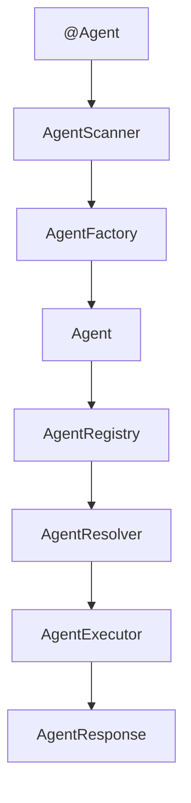

# Sprint5 - Agent Definition Framework

## Overview

Sprint5 introduces the Agent Definition Framework.

It allows developers to define agents declaratively using `@Agent`.

## Architecture

## Core Components

| Component | Responsibility |
|---|---|
| Agent | Defines runtime configuration of an Agent |
| @Agent | Declares Agent metadata |
| AgentFactory | Converts annotation metadata into Agent |
| AgentScanner | Discovers Agent declarations |
| AgentRegistry | Registers and manages Agents |
| AgentResolver | Resolves Agent by name |
| AgentExecutor | Executes Agent requests |

## Design Decisions

- Agent is treated as a framework-managed runtime configuration.
- `@Agent` is used as the declarative programming model.
- Scanner discovers declarations but does not execute Agents.
- Registry manages Agent lifecycle.
- Resolver separates name-based lookup from execution.